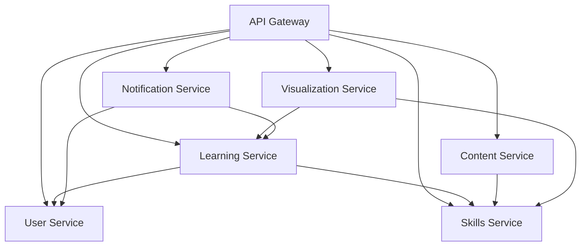

# Skill Circle Microservices Architecture

## Architecture Overview

This project implements a microservices architecture for the Skill Circle learning platform, breaking down the monolithic application into independent, scalable services.

## Services Architecture

```
┌─────────────────────────────────────────────────────────────┐
│                    API Gateway (Port 3000)                  │
│                     • Route Management                      │
│                     • Load Balancing                        │
│                     • Authentication                        │
│                     • Rate Limiting                         │
└─────────────────────────────────────────────────────────────┘
                                  │
                ┌─────────────────┼─────────────────┐
                │                 │                 │
┌───────────────▼────┐  ┌─────────▼────┐  ┌────────▼─────────┐
│  User Service      │  │ Skills Service│  │ Learning Service │
│  (Port 3001)       │  │ (Port 3002)   │  │ (Port 3003)      │
│                    │  │               │  │                  │
│ • Authentication   │  │ • Skill Catalog│  │ • Progress Track │
│ • User Profiles    │  │ • Categories   │  │ • Assessments    │
│ • Preferences      │  │ • Roadmaps     │  │ • Certificates   │
│ • JWT Management   │  │ • Prerequisites│  │ • Learning Paths │
│                    │  │               │  │                  │
│ DB: PostgreSQL     │  │ DB: MongoDB   │  │ DB: PostgreSQL   │
└────────────────────┘  └───────────────┘  └──────────────────┘

┌────────────────────┐  ┌───────────────┐  ┌──────────────────┐
│ Content Service    │  │Visualization  │  │Notification Svc  │
│ (Port 3004)        │  │Service        │  │ (Port 3006)      │
│                    │  │ (Port 3005)   │  │                  │
│ • Courses          │  │ • Interactive │  │ • Real-time      │
│ • Encyclopedia     │  │   Charts      │  │ • Email/SMS      │
│ • Resources        │  │ • Progress    │  │ • Push Notifs    │
│ • Institutional    │  │   Animations  │  │ • Websockets     │
│   Courses          │  │ • Skill Trees │  │                  │
│                    │  │               │  │                  │
│ DB: MongoDB        │  │ DB: Redis     │  │ DB: Redis        │
└────────────────────┘  └───────────────┘  └──────────────────┘
```

## Technology Stack

- **API Gateway**: Express.js with HTTP Proxy Middleware
- **Service Discovery**: Consul (or simple service registry)
- **Authentication**: JWT with Redis for token storage
- **Databases**:
  - PostgreSQL for user data and learning progress
  - MongoDB for skills, content, and courses
  - Redis for caching and real-time data
- **Message Queue**: Redis Pub/Sub for inter-service communication
- **Containerization**: Docker & Docker Compose
- **Load Balancing**: Nginx (production)

## Service Responsibilities

### 1. User Service (Port 3001)
- User registration and authentication
- Profile management
- Preferences and settings
- JWT token management
- Password reset and email verification

### 2. Skills Service (Port 3002)
- Skill catalog management
- Categories and subcategories
- Skill roadmaps and learning paths
- Prerequisites and dependencies
- Skill metadata and descriptions

### 3. Learning Service (Port 3003)
- Progress tracking across all skills
- Assessment and quiz management
- Certificate generation
- Learning analytics
- Achievement and badge system

### 4. Content Service (Port 3004)
- Course content management
- Encyclopedia articles
- Resource libraries
- Institutional course data
- Content versioning and publishing

### 5. Visualization Service (Port 3005)
- Interactive skill visualizations
- Progress charts and animations
- Skill tree rendering
- Custom visualization APIs
- SVG generation and caching

### 6. Notification Service (Port 3006)
- Real-time notifications
- Email and SMS delivery
- Push notification management
- WebSocket connections
- Notification templates

## Communication Patterns

### Synchronous Communication
- HTTP/REST APIs for real-time user interactions
- Service-to-service calls for immediate data needs

### Asynchronous Communication
- Redis Pub/Sub for event-driven updates
- Message queues for background processing

### Data Consistency
- Event sourcing for critical business events
- Saga pattern for distributed transactions
- CQRS for read/write separation where needed

## Development Setup

1. **Prerequisites**
   ```bash
   - Node.js 18+
   - Docker & Docker Compose
   - PostgreSQL 14+
   - MongoDB 6+
   - Redis 7+
   ```

2. **Quick Start**
   ```bash
   # Clone the repository
   git clone <repo-url>
   cd skill-circle/microservices

   # Start all services
   docker-compose up -d

   # Or start individual services
   npm run dev:user-service
   npm run dev:skills-service
   npm run dev:learning-service
   ```

3. **Service URLs**
   - API Gateway: http://localhost:3000
   - User Service: http://localhost:3001
   - Skills Service: http://localhost:3002
   - Learning Service: http://localhost:3003
   - Content Service: http://localhost:3004
   - Visualization Service: http://localhost:3005
   - Notification Service: http://localhost:3006

## Monitoring & Observability

- **Health Checks**: Each service exposes `/health` endpoint
- **Metrics**: Prometheus metrics collection
- **Logging**: Centralized logging with ELK stack
- **Tracing**: Distributed tracing with Jaeger
- **Service Discovery**: Consul for service registration

## Deployment

### Development
- Docker Compose for local development
- Hot reload enabled for all services

### Production
- Kubernetes manifests for orchestration
- Helm charts for deployment
- CI/CD pipeline with automated testing
- Blue-green deployment strategy

## Security

- JWT-based authentication with refresh tokens
- API rate limiting and throttling
- CORS configuration per service
- Input validation and sanitization
- SQL injection and XSS protection
- Secret management with environment variables

## Migration Strategy

1. **Phase 1**: Extract User Service
2. **Phase 2**: Extract Skills Service
3. **Phase 3**: Extract Learning Service
4. **Phase 4**: Extract Content Service
5. **Phase 5**: Extract Visualization Service
6. **Phase 6**: Add Notification Service
7. **Phase 7**: Implement API Gateway
8. **Phase 8**: Add monitoring and observability

## Service Dependencies

